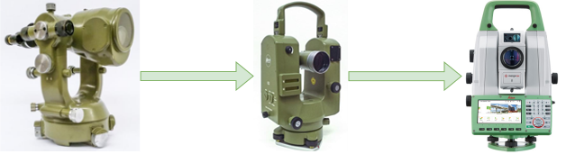

# Introduction

## Products

 \

# Why reusable Software? Complexity

## Complexity
 \


# Why reusable Software? Changes

## Reasons for Changes

 \

# Why reusable Software? Reuse vs. Mutation

## original
\scriptsize
```cpp
/*...*/
sensor::sensor(spi_driver& spi, /*...*/) 
    : /*...*/, m_reset(gpio::port_e, 1, gpio::digital_output) {}
/*...*/
```
\normalsize

## mutation
\scriptsize
```cpp
/*...*/
sensor::sensor(spi_driver& spi, /*...*/) 
    : /*...*/, m_reset(gpio::port_e, 2, gpio::digital_output) {}
/*...*/
```
\normalsize

# Why reusable Software? Reuse vs. Mutation

## refactoring
\scriptsize
```cpp
// bsp is defined for each board configuration
namespace bsp {
    static constexpr gpio_cfg sensor_reset_pin = 
            {gpio::port_e, 2, gpio::digital_output}; 
}

/*...*/
#include <bsp/pin_cfg.hpp>

sensor::sensor(spi_driver& spi, /*...*/) 
    : /*...*/, m_reset(bsp::sensor_reset_pin) {}
/*...*/
```
\normalsize

# Why reusable Software? Abstractions

## Taking back control
{ width=200px } \

# Why reusable Software?

## Benefits 

* Reuse of functionality between products
* Management of system complexity
* Reduced development time
* Shorter time to the market

## Drawbacks

* Higher initial development time
* Needs to consider "all" project restrictions
* Regressions would be a disaste

# Why reusable Software?

## What needs to be done?

* Create hardware abstraction
* Create middleware abstraction
* Separate business logic components
* Enable separate integration step
* Consider testing for all layers
