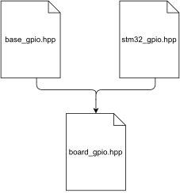

# Hardware Abstraction Layer

## GPIO
\scriptsize
```cpp
template <typename SOC_TYPE>
struct base_gpio {
    using soc_type = SOC_TYPE;
    using device_type = trait::soc_gpio_device_t<SOC_TYPE>;
    using config_type = typename device_type::config_type;
   
    constexpr base_gpio(config_type cfg) noexcept; 
    constexpr const device_type& device() const noexcept;
    
    inline error_code init(pin_state state) noexcept;
    inline error_code write(pin_state state) noexcept;
    /* ... */
};
```
\normalsize

# Hardware Abstraction Layer

## GPIO Test
\scriptsize
```cpp
template <>
struct base_gpio<tests::gtest> : tests::gtest_base_mock {
    using soc_type = tests::gtest;
    using device_type = trait::soc_gpio_device_t<tests::gtest>;
    using config_type = typename device_type::config_type;
   
    constexpr base_gpio(config_type cfg) noexcept; 
    constexpr const device_type& device() const noexcept;
    /* ... */
};
```
\normalsize

# Hardware Abstraction Layer

## Board Support

{ width=100px } \

\scriptsize
```cpp
#include <base/base_gpio.hpp>
#include <soc/st/stm32g4.hpp>

/*...*/
using gpio = base_gpio<soc::st::stm32g4>;

// using gpio = base_gpio<soc::nordic::nrf52>;
// using gpio = base_gpio<rtos::zephyr>;
// using gpio = base_gpio<tests::gtest>;
```
\normalsize


# Hardware Abstraction Layer

## Device Tree

\scriptsize
```
pinctrl: pin-controller@48000000 {
	gpioa: gpio@48000000 {
		reg = < 0x48000000 0x400 >;
	    # ...
    };
};

leds {
	green_led: led_0 {
		gpios = < &gpioa 0x5 GPIO_ACTIVE_HIGH>;
	};
};
```

```cpp
using gpioa = gpio_ctrl<register<0x48000000 0x400>, /*...*/>;
using green_led_cfg = gpio_cfg<gpioa, 0x05, gpio::active_high>
```
\normalsize

# Hardware Abstraction Layer

## Summary

* Consider effort
* Choose flexible abstractions
* Hide complexity for the user, but don’t restrict
* Consider tests and simulations
* Think about code generation
