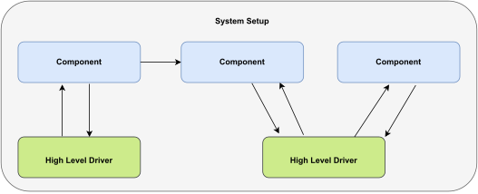
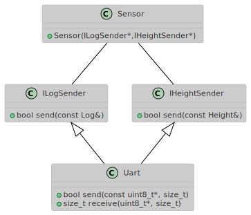
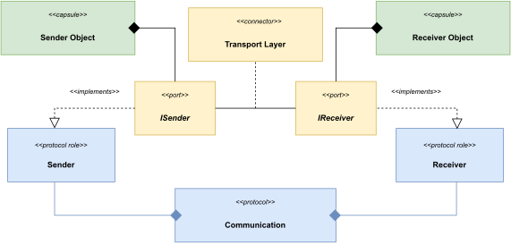
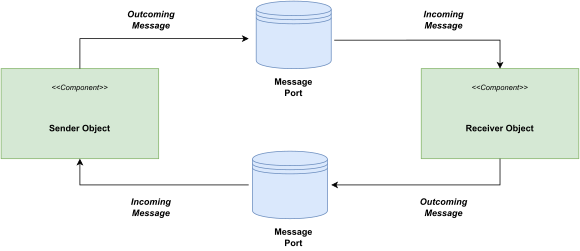

# Business Logic

## Business Logic Layer
 \

# Business Logic: Communication

## interface injection
{ height=200px } \

# Business Logic: Communication

\footnotesize
## Direct Interface
* Creates dependencies between components
* Can inject unwanted behavior

## Protocol Abstraction
* Layer over the communication
* Only protocol knows messages
    * Handles decoding and dispatching
    * Handles encoding and sending
* Thread transition can be enforced
\normalsize

# Business Logic: ROOM-Pattern

## ROOM-Pattern
 \

# Business Logic: Microservice

## Microservice
 \

# Business Logic: Communication

## Message Port
\scriptsize
```cpp
template<class RECEIVER_T, typename PROTOCOL_T>
struct write_port {
    using protocol_type = PROTOCOL_T;
    using receiver_type = RECEIVER_T;
    using message_types = trait::incoming_messages_t<receiver_type> 

    write_port(receiver_type& receiver) noexcept;

    template <typename MSG_T> 
    requires concepts::contains<trait::convert_t<MSG_T, protocol_type>, 
                                message_types>
    bool write(const MSG_T& msg) noexcept {
        const auto msg_out = convert<protocol_type>(msg);
        return receive_message(m_receiver, msg_out);
        // could also be dispatched over message_queue, ipc etc.
    }
    /*...*/
};

```
\normalsize

# Business Logic: Communication

## Receiving Messages
\scriptsize
```cpp
template <typename>
struct incoming_messages {
    using type = ::util::sequence<>;
};

template <>
struct incoming_messages<component> {
    using type = ::util::sequence<log_msg, ...>;
};

bool receive_message(component& obj, const log_msg& msg) {/*...*/}
bool receive_message(component& obj, const auto& msg) {/*...*/}
```
\normalsize

# Business Logic: Communication

## Sending Messages (interface port)

\scriptsize
```cpp
struct i_component_write {
    virtual bool write(const component_msg&) const noexcept = 0;
};

template<typename PROTOCOL_T>
struct component_write_port : i_component_write {
    bool write(const component_msg& msg) const noexcept override;
    /*...*/
};

struct component {
    component(i_component_write& port) noexcept;
};
```
\normalsize

# Business Logic: Communication

## Sending Messages (type erasure port)
\scriptsize
```cpp
template<typename ... Ts>
class write_port_ref<util::sequence<Ts...>> {
public:
    using operation_types = 
        typename detail::write_port_operations<Ts...>::type;
    
    template<typename T>
    write_port_ref(const T& obj);

    template<typename T>
    void write(const T& msg) const noexcept;
    /*...*/
};

struct component {
    using write_port_type = 
        write_port_ref<outcoming_messages_t<component>>;
    component(write_port_type port) : m_port(port) {}
};
```
\normalsize


# Business Logic: System Setup

## System Setup
\scriptsize
```cpp
class system_setup {
    /*...*/

    system_setup() noexcept 
        : m_uart(uart_cfg)
        , m_component(component::write_port_type{m_port}, thread_cfg)
    {/*...*/}

    bool init() noexcept;
    bool startup() noexcept;
    bool shutdown() noexcept;
    /*...*/

    uart_driver m_uart;
    component   m_component;

    using component_port = write_port<uart_driver, protocol::inhouse>
    component_port m_port{m_uart};
};
```
\normalsize


# Summary

## Keep in Mind
* Consider all possibilities for changes
* Isolate the hardware and take control
* Isolate the middleware and allow host build
* Design components independent and interchangeable
* Consider testing over all abstractions of your design

